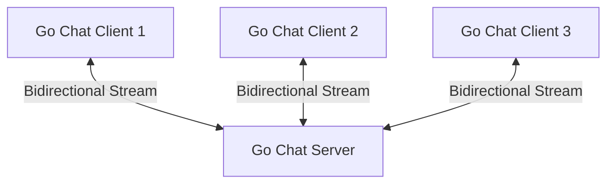

# gRPC Chat Application in Go

A real-time, terminal-based chat application built using Go and gRPC bidirectional streaming.

## Features

- **Real-Time Communication**: Uses gRPC bidirectional streaming for instant message broadcasts.
- **Concurrent Connections**: Supports multiple users chatting simultaneously.
- **Join/Leave Notifications**: Automatically notifies the room when a user joins or exits.
- **Interactive Command Line**: Prompts for a username on start, formats incoming messages with timestamps, and supports `/quit` / `/exit` commands.

## Architecture

The server maintains a registry of active client streams. When any client sends a message, the server broadcasts it to all currently active client streams in a thread-safe manner.



## Getting Started

### Prerequisites

- Go (1.25+ recommended)
- Protocol Buffers compiler (`protoc`) and Go plugins:
  - `protoc-gen-go`
  - `protoc-gen-go-grpc`

### Installation

Clone the repository:
```bash
git clone https://github.com/williampepple1/chat_grpc.git
cd chat_grpc
```

Tidy dependencies:
```bash
go mod tidy
```

### Code Generation

To compile the Protocol Buffers schema (`proto/chat.proto`) into Go code, run the generation script:

On Windows:
```cmd
generate.bat
```

Or run the command manually:
```bash
protoc --go_out=. --go_opt=paths=source_relative --go-grpc_out=. --go-grpc_opt=paths=source_relative proto/chat.proto
```

---

## Running the Application

1. **Start the Chat Server** (listens on port `:50051` by default):
   ```bash
   go run server/main.go
   ```

2. **Start multiple Chat Clients** (run in separate terminal windows):
   ```bash
   go run client/main.go
   ```

3. **Leave the Chat**:
   Type `/quit` or `/exit` in the client terminal to exit cleanly.
